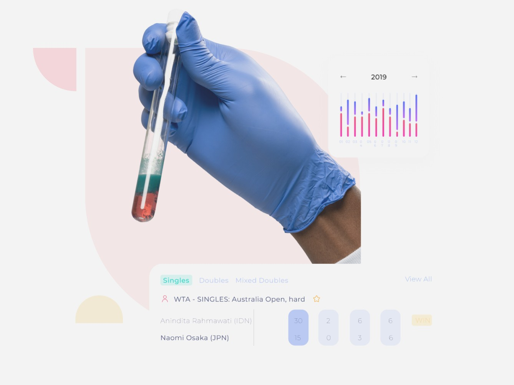

# GlucoNet - AI-Powered Diabetes Prediction Web App


## 🧠 Abstract

**GlucoNet** is an AI-based web application designed to predict the risk of diabetes using essential health parameters. The application leverages a **Random Forest Classifier** trained on key features such as:

- Pregnancies  
- Blood Glucose  
- Blood Pressure  
- Body Mass Index (BMI)  
- Age  
- Diabetes Pedigree Function (DPF)

These features were selected based on their strong correlation with diabetes onset, ensuring a reliable and explainable model.

---

## 🚀 Features

- 🔍 **Instant Diabetes Risk Prediction** using a trained ML model  
- 💡 **Personalized Suggestions** based on prediction result  
- 🌐 **Web-based Interface** built with **Flask (Python)**  
- 🎨 **Clean UI** designed using **Figma**  
- ☁️ **Deployed on Railway** for live accessibility  
- 📱 **Responsive Design** – works across devices  

---

## 🛠️ Tech Stack

| Tech               | Usage                         |
|--------------------|-------------------------------|
| Python             | Core language for backend & ML|
| Flask              | Web framework                 |
| Scikit-learn       | Model training (Random Forest)|
| HTML/CSS/Bootstrap | Frontend UI                   |
| Figma              | UI/UX Design                  |
| Railway            | Deployment platform           |

---

## 📸 Screenshots



---

## 🧪 How It Works

1. User enters their health metrics into the form.
2. Data is scaled using the trained `scaler.pkl`.
3. The model (`model.pkl`) predicts whether the user is likely diabetic.
4. Result is shown instantly on the same page using a modal popup.
5. Depending on the result, advice or next steps are suggested.

---

## 📦 Installation (Local Setup)

```bash
git clone https://github.com/your-username/gluconet.git
cd gluconet
pip install -r requirements.txt
python app.py
```
---

# 🌐 Live Demo

> 🚧 Add your live link here once deployed
https://gluconet-production.up.railway.app

---

# 👨‍💻 Developed By

**Sreedev SV**

> [LinkedIn](https://www.linkedin.com/in/sreedevsv/) · [GitHub](https://github.com/sreedevsv)

---

# 📃 License

This project is licensed under the MIT License.

---
